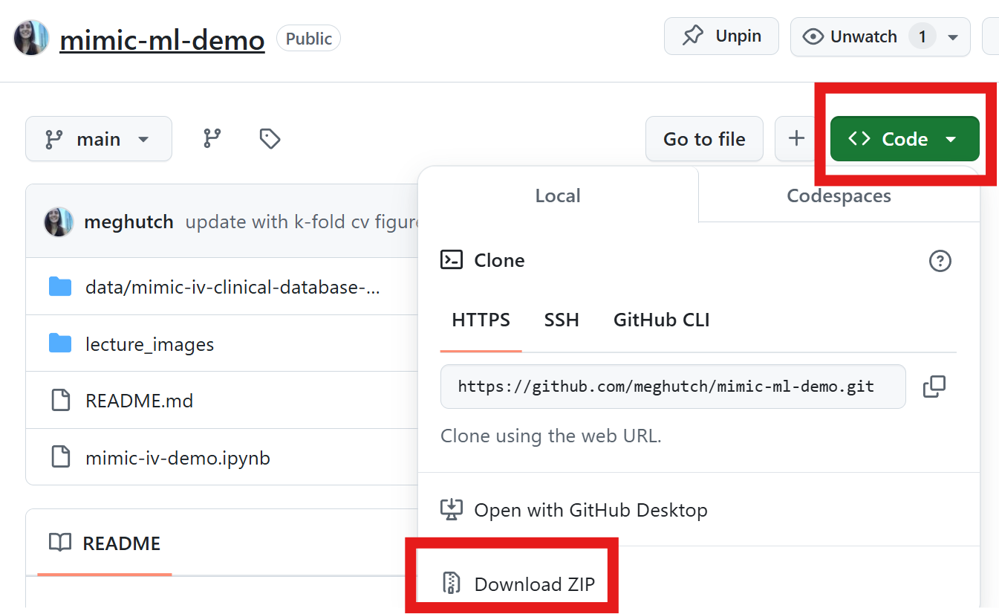

### Introduction

This repository houses a Jupyter-notebook and slideshow to introduce students to clinical research with electronic health records (EHR) using the MIMIC-IV database. The lecture also introduces concepts for training machine learning models using scikit-learn functions*

A lecture for Northwestern University's Methods in Biomedical Informatics II Course

---

### Download

To download all of the materials of this repository, click the Green Code button as shown in the image below:

From the subsequent drop down menu, the material can be downloaded in one of two ways:

1. **Download ZIP button**: downloads the repo as a .zip file (this may be easiest if you are not familiar with the terminal)

2. **Terminal**: open a terminal and enter the following command in your local directory  where you'd like to download the files:

> `git clone https://github.com/meghutch/mimic-ml-demo.git` 

---

*Inspired and adapted by Dr. Garrett Eickelberg's [workshop on MIMIC-III and scikit learn](https://github.com/geickelb/MIMIC-III_to_Model/tree/master)